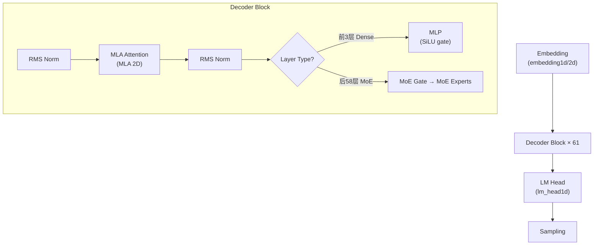

# DeepSeek V3 在 tt-metal 中的支持状况

## 总结

> [!IMPORTANT]
> **DeepSeek V3 (及 DeepSeek-R1) 是 tt-metal 中支持最完善的大模型之一**。已实现完整的端到端推理，包括 decode、prefill、vLLM 集成、多主机 Galaxy 部署等。

---

## 支持的模型 checkpoint

| Checkpoint | 支持状态 |
|------------|---------|
| [deepseek-ai/DeepSeek-R1-0528](https://huggingface.co/deepseek-ai/DeepSeek-R1-0528) | ✅ **主要目标** |
| [deepseek-ai/DeepSeek-R1](https://huggingface.co/deepseek-ai/DeepSeek-R1) | ✅ 兼容 |
| [deepseek-ai/DeepSeek-V3](https://huggingface.co/deepseek-ai/DeepSeek-V3) | ✅ 兼容 |

---

## 硬件平台支持

| 平台 | 支持状态 | 说明 |
|------|---------|------|
| Galaxy 2x (2 主机) | ✅ 完整支持 | 通过 `launch_multihost_galaxy.py` 脚本 |
| Galaxy 4x (4 主机) | ✅ 完整支持 | 通过 `launch_multihost_galaxy.py` 脚本 |
| 单 Galaxy (TG) | ⚠️ 有限支持 | 可跑 5 层简化模型 + 子模块单元测试 |

> [!WARNING]
> **你的机器是单 Galaxy (Wormhole)**，只能运行简化版本（5层）和子模块测试，无法运行完整的 61 层 DeepSeek V3。

---

## 已实现的组件

### 完整的模型 pipeline



### 各模块实现文件

| 组件 | 文件 | 大小 | 说明 |
|------|------|------|------|
| **Generator (主入口)** | [generator.py](file:///home/stc/chengtao/tt-metal/models/demos/deepseek_v3/tt/generator.py) | 159KB / 3399行 | 完整的 decode+prefill generator |
| **vLLM Generator** | [generator_vllm.py](file:///home/stc/chengtao/tt-metal/models/demos/deepseek_v3/tt/generator_vllm.py) | 14KB | vLLM 后端适配 |
| **MoE 模块** | [moe.py](file:///home/stc/chengtao/tt-metal/models/demos/deepseek_v3/tt/moe.py) | 25KB | dispatch → experts → combine → reduce-scatter |
| **MoE 优化版** | [moe_optimized.py](file:///home/stc/chengtao/tt-metal/models/demos/deepseek_v3/tt/moe_optimized.py) | 29KB | 融合优化的 MoE |
| **MoE Gate** | [moe_gate.py](file:///home/stc/chengtao/tt-metal/models/demos/deepseek_v3/tt/moe_gate.py) | 22KB | sigmoid 评分 + noaux_tc topk |
| **MoE Experts** | [experts.py](file:///home/stc/chengtao/tt-metal/models/demos/deepseek_v3/tt/experts.py) | 19KB | 专家网络 matmul |
| **MLA Attention** | [mla1d.py](file:///home/stc/chengtao/tt-metal/models/demos/deepseek_v3/tt/mla/mla1d.py) | 110KB | Multi-head Latent Attention (1D) |
| **MLA 2D** | [mla2d.py](file:///home/stc/chengtao/tt-metal/models/demos/deepseek_v3/tt/mla/mla2d.py) | 7KB | MLA 2D 版本 |
| **Decoder Block** | [decoder_block_base.py](file:///home/stc/chengtao/tt-metal/models/demos/deepseek_v3/tt/decoder_block/decoder_block_base.py) | 8KB | 解码器块基类 |
| **MoE Decoder Block** | [moe_decoder_block_2d.py](file:///home/stc/chengtao/tt-metal/models/demos/deepseek_v3/tt/decoder_block/moe_decoder_block_2d.py) | 11KB | MoE 解码器块 |
| **MLP** | [mlp/](file:///home/stc/chengtao/tt-metal/models/demos/deepseek_v3/tt/mlp) | — | Dense FFN 层 |
| **Embedding** | [embedding1d.py](file:///home/stc/chengtao/tt-metal/models/demos/deepseek_v3/tt/embedding/embedding1d.py) | 10KB | 词嵌入 |
| **RoPE** | [rope.py](file:///home/stc/chengtao/tt-metal/models/demos/deepseek_v3/tt/rope.py) | 14KB | 旋转位置编码 |
| **RMS Norm** | [rms_norm/](file:///home/stc/chengtao/tt-metal/models/demos/deepseek_v3/tt/rms_norm) | — | RMSNorm |
| **LM Head** | [lm_head1d.py](file:///home/stc/chengtao/tt-metal/models/demos/deepseek_v3/tt/lm_head1d.py) | 11KB | 输出头 |
| **MTP** | [mtp.py](file:///home/stc/chengtao/tt-metal/models/demos/deepseek_v3/tt/mtp.py) | 17KB | Multi-Token Prediction |
| **CCL 通信** | [ccl.py](file:///home/stc/chengtao/tt-metal/models/demos/deepseek_v3/tt/ccl.py) | 9KB | 集合通信 |
| **Model (Row Batched)** | [row_batched_model.py](file:///home/stc/chengtao/tt-metal/models/demos/deepseek_v3/tt/model/row_batched_model.py) | 27KB | 行批处理模型组装 |

### Disaggregated Prefill (分离式预填充)

| 组件 | 位置 | 说明 |
|------|------|------|
| Prefill Pipeline | [tt_deepseek_prefill_pipeline.py](file:///home/stc/chengtao/tt-metal/models/demos/deepseek_v3_d_p/tt/tt_deepseek_prefill_pipeline.py) | 分离式 prefill 管线 |
| Prefill Transformer | [tt_prefill_transformer.py](file:///home/stc/chengtao/tt-metal/models/demos/deepseek_v3_d_p/tt/tt_prefill_transformer.py) | Prefill 变压器 |
| Prefill Block | [tt_prefill_block.py](file:///home/stc/chengtao/tt-metal/models/demos/deepseek_v3_d_p/tt/tt_prefill_block.py) | 分离式 prefill 块 |
| Distributed RMS Norm | [tt_distributed_rms_norm.py](file:///home/stc/chengtao/tt-metal/models/demos/deepseek_v3_d_p/tt/tt_distributed_rms_norm.py) | 分布式 RMSNorm |
| MoE (Prefill) | [tt/moe/](file:///home/stc/chengtao/tt-metal/models/demos/deepseek_v3_d_p/tt/moe) | Prefill 版 MoE |
| MLA (Prefill) | [tt/mla/](file:///home/stc/chengtao/tt-metal/models/demos/deepseek_v3_d_p/tt/mla) | Prefill 版 MLA |

---

## 运行方式

### 1. 多主机 Demo (完整模型)
```bash
# 2x Galaxy
./models/demos/deepseek_v3/scripts/launch_multihost_galaxy.py 2x -- python models/demos/deepseek_v3/demo/demo.py \
  --model-path $DEEPSEEK_V3_HF_MODEL \
  --early_print_first_user \
  "Write a haiku about autumnal days by the sea"
```

### 2. 单 Galaxy 简化模式 (5层)
```bash
MESH_DEVICE=TG python models/demos/deepseek_v3/demo/demo.py \
  --prompts-file models/demos/deepseek_v3/demo/demo_aime24_gpqa_short.json \
  --output-path deepseek_tt_out_batch_4.json \
  --max-new-tokens 128 \
  --model-path $DEEPSEEK_V3_HF_MODEL
```

### 3. vLLM Server
```bash
VLLM_RPC_TIMEOUT=1000000 MESH_DEVICE="(4,8)" \
python plugins/vllm-tt-plugin/examples/server_example_tt.py \
  --model "deepseek-ai/DeepSeek-R1-0528" \
  --max_model_len 1024 \
  --block_size 32
```

### 4. Random Weights 测试 (无需权重)
```bash
python models/demos/deepseek_v3/demo/demo.py --random-weights --single-layer mlp
```

---

## 已支持的高级功能

| 功能 | 状态 | 说明 |
|------|------|------|
| Decode 推理 | ✅ | 完整 61 层 decode |
| Prefill 推理 | ✅ | 支持长序列分块 (16K tokens/chunk) |
| Trace 优化 | ✅ | `--enable-trace` 加速 decode |
| Teacher Forcing 精度验证 | ✅ | Top-1/Top-5 accuracy |
| MTP (Multi-Token Prediction) | ✅ | `--mtp on` 启用推测解码 |
| vLLM 后端 | ✅ | 完整的 vLLM 集成 |
| Batch 生成 | ✅ | 多用户并行生成 |
| 权重 dequantize | ✅ | HF fp8 权重 → bf16 |
| Paged Attention | ✅ | KV cache 分页管理 |
| On-device Sampling | ✅ | 设备端采样 (temperature, top-k, top-p) |
| 性能指标 | ✅ | prefill t/s, decode t/s/u |

---

## 测试覆盖

| 测试文件 | 测试内容 |
|---------|---------|
| [test_model.py](file:///home/stc/chengtao/tt-metal/models/demos/deepseek_v3/tests/test_model.py) (28KB) | 完整模型测试 |
| [test_moe.py](file:///home/stc/chengtao/tt-metal/models/demos/deepseek_v3/tests/test_moe.py) | MoE 模块测试 |
| [test_mla.py](file:///home/stc/chengtao/tt-metal/models/demos/deepseek_v3/tests/test_mla.py) (19KB) | MLA 注意力测试 |
| [test_mlp.py](file:///home/stc/chengtao/tt-metal/models/demos/deepseek_v3/tests/test_mlp.py) (11KB) | MLP 测试 |
| [test_moe_gate.py](file:///home/stc/chengtao/tt-metal/models/demos/deepseek_v3/tests/test_moe_gate.py) | Gate 网络测试 |
| [test_moe_experts.py](file:///home/stc/chengtao/tt-metal/models/demos/deepseek_v3/tests/test_moe_experts.py) (28KB) | Expert 网络测试 |
| [test_decoder_block.py](file:///home/stc/chengtao/tt-metal/models/demos/deepseek_v3/tests/test_decoder_block.py) | Decoder Block 测试 |
| [test_mtp.py](file:///home/stc/chengtao/tt-metal/models/demos/deepseek_v3/tests/test_mtp.py) (105KB) | MTP 测试 |
| [test_demo.py](file:///home/stc/chengtao/tt-metal/models/demos/deepseek_v3/demo/test_demo.py) (19KB) | Demo 端到端测试 |
| [test_demo_aime.py](file:///home/stc/chengtao/tt-metal/models/demos/deepseek_v3/demo/test_demo_aime.py) | AIME 数学竞赛评测 |
| [test_bspm_demo.py](file:///home/stc/chengtao/tt-metal/models/demos/deepseek_v3/tests/test_bspm_demo.py) (51KB) | BSPM 集成测试 |

---

## V3 vs V4 对比

| 维度 | DeepSeek V3 | DeepSeek V4 Flash/Pro |
|------|:-----------:|:--------------------:|
| **完整模型实现** | ✅ 完整 (`models/demos/deepseek_v3/`) | ❌ 无 |
| **Gate** | ✅ sigmoid + noaux_tc | ❌ sqrtsoftplus 未实现 |
| **Attention** | ✅ MLA | ❌ NSA 未实现 |
| **MoE compute** | ✅ 通过 | ❌ Flash 精度不通过，Pro crash |
| **Generator** | ✅ 159KB 完整实现 | ❌ 无 |
| **Demo** | ✅ 可交互运行 | ❌ 无 |
| **vLLM** | ✅ 集成 | ❌ 无 |
| **权重加载** | ✅ 支持 HF checkpoint | ❌ 无 |
| **测试覆盖** | ✅ 28+ 测试文件 | ⚠️ 仅 YAML config + 失败的 MoE 测试 |

---

## 对你的 Wormhole 单 Galaxy 机器的建议

1. **DeepSeek V3 子模块测试可以跑**：
   ```bash
   docker exec -it -w /root/tt-metal ct_metal bash -c "pytest models/demos/deepseek_v3/tests/test_mlp.py"
   docker exec -it -w /root/tt-metal ct_metal bash -c "pytest models/demos/deepseek_v3/tests/test_mla.py"
   ```

2. **简化版 Demo (5层) 可以尝试**（需要权重）：
   ```bash
   docker exec -it -w /root/tt-metal ct_metal bash -c \
     "MESH_DEVICE=TG python models/demos/deepseek_v3/demo/demo.py \
       --model-path /path/to/weights \
       --max-new-tokens 32 \
       'Hello, what is the capital of France?'"
   ```

3. **完整 61 层推理**需要至少 **2x Galaxy (2 主机)**
4. **DeepSeek V4 目前在 tt-metal 中无法运行**
