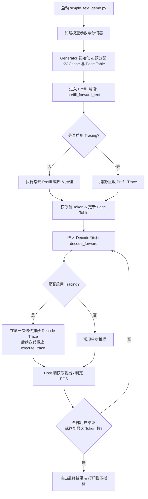

# Tenstorrent LLM 推理运行机制：Tracing 与 Batching 技术详解 (以 Llama 3.1 为例)

本技术文档面向编译器与系统工程人员，详细剖析 `tt-metal` 中 LLM 推理测试脚本 [simple_text_demo.py](file:///home/stc/chengtao/tt-metal/models/tt_transformers/demo/simple_text_demo.py) 的底层运行机制。我们将重点剖析设备图捕获机制（**Tracing**）与批处理数据排布（**Batching**），并以 Llama 3.1 模型为例进行深入剖析。

---

## 1. LLM 推理生命周期概述

LLM 的推理流程包含两个典型阶段：
1. **Prefill（预填充）阶段**：处理 Prompt 输入，计算输入 Token 的 Key/Value 并写入 KV Cache。由于输入 Token 较多，该阶段为**计算密集型**（Compute-Bound）。
2. **Decode（解码）阶段**：根据已有的 KV Cache，逐个 Token 自回归地生成后续内容。由于每次只处理 1 个 Token，该阶段为严重的**访存密集型**（Memory-Bound）。

在 `simple_text_demo.py` 中，运行流程主要由 [Generator](file:///home/stc/chengtao/tt-metal/models/tt_transformers/tt/generator.py) 控制：



---

## 2. Tracing 机制（图捕获与执行）

对于自回归的 Decode 阶段，由于每个 Token 的执行耗时极短（通常在几毫秒到十几毫秒之间），**Host-to-Device (H2D) 的调度开销、Python 解释器开销以及算子下发序列化开销**会成为明显的性能瓶颈。

Tenstorrent 的 `ttnn` 引入了 **Trace** 机制：在运行时捕获完整的算子图和设备执行指令流，生成可重放的硬件 Command Queue 序列。之后每次 Decode 仅需更新指定的输入 Buffer，即可在设备端高效率地一键重放。

### 2.1 Trace 捕获流程 (`_capture_decode_trace_text`)

在 [generator.py:L1320](file:///home/stc/chengtao/tt-metal/models/tt_transformers/tt/generator.py#L1320) 的 `_capture_decode_trace_text` 中，捕获动作包含三个步骤：

1. **Warmup/编译运行 (No-Trace Run)**：
   调用 `_decode_forward_no_trace_text` 运行一次，这会触发 `ttnn` 内部算子的编译以及在 L1/DRAM 中分配临时的张量 Buffer，确保后续运行时无编译停顿。
2. **准备 Trace 设备输入张量**：
   在 Host 端调用 `prepare_decode_inputs_host` 获取输入（包括 tokens, current_pos, rope_idxs, page_table 等），然后调用 `copy_host_to_device` 在设备端创建**静态的输入张量**（固定设备内存地址）：
   ```python
   device_inputs_i = copy_host_to_device(host_inputs, mesh_device=self.model_args[i].mesh_device)
   ```
3. **开启图捕获**：
   通过 `ttnn.begin_trace_capture` 和 `ttnn.end_trace_capture` 包裹实际的模型前向传播方法 `ttnn_decode_forward`：
   ```python
   trace_id = ttnn.begin_trace_capture(self.model_args[i].mesh_device, cq_id=0)
   # 执行前向传播，入参使用刚才创建的静态 device_inputs_i
   tt_out_trace.append(
       self.model[i].ttnn_decode_forward(
           *device_inputs[i],
           kv_cache=user_kv_cache,
           sampling_on_device=sampling_on_device,
           capture_sampling_trace=split_enabled,
       )
   )
   ttnn.end_trace_capture(self.model_args[i].mesh_device, trace_id, cq_id=0)
   ```
   捕获结束后，会返回一个 `trace_id`，它与静态输入 `device_inputs`、静态输出 `tt_out_trace` 一起缓存。

### 2.2 Trace 重放与原地更新 (In-place Update)

捕获的 Trace 图中，所有的算子输入与输出地址都已经是**硬编码的物理内存指针**。为了输入新的 Token 进行重放，我们不能创建新的张量，而是必须将新数据拷贝写入到已捕获 Trace 的输入张量地址中。

在 [generator.py:L1382](file:///home/stc/chengtao/tt-metal/models/tt_transformers/tt/generator.py#L1382) `_decode_forward_trace_text` 中：

1. **输入数据就地更新**：
   每次迭代时，通过 `prepare_decode_inputs_host` 拿到当前步的 Token 和位置信息，然后调用 `copy_host_to_device` 拷贝到已有的 Trace 输入张量中：
   ```python
   copy_host_to_device(
       host_tensors=host_inputs_i,
       device_tensors=self.trace_inputs_decode[sampling_on_device][i], # 已捕获的静态输入张量
   )
   ```
2. **异步执行重放**：
   调用 `ttnn.execute_trace`，硬件直接读取静态输入张量，并利用片上 Command Processor 触发内核运行，Host 端无需重新下发内核指令。
   ```python
   ttnn.execute_trace(self.model_args[i].mesh_device, trace_id, cq_id=0, blocking=False)
   ```

```
Host (Python)                                            Device (TT Chip)
+-----------------------------+                          +------------------------+
| 1. prepare_decode_inputs_   |                          |                        |
|    host (new tokens, pos)   |                          |                        |
+--------------+--------------+                          |                        |
               |                                         |                        |
               v (H2D copy in-place)                     |                        |
+--------------+--------------+                          |                        |
| 2. copy_host_to_device      |------------------------->| [Static Input Buffer]  |
|    (writes to static addr)  |                          |         |              |
+--------------+--------------+                          |         |              |
               |                                         |         | (Read Data)  |
               v (dispatch execute command)              |         v              |
+--------------+--------------+                          |  +---------------+     |
| 3. ttnn.execute_trace       |------------------------->|  | Captured Graph|     |
|    (trace_id, blocking=False)                          |  +-------+-------+     |
+-----------------------------+                          |          |             |
                                                         |          v (Write Out) |
                                                         | [Static Output Buffer] |
                                                         +------------------------+
```

> [!WARNING]
> 由于 Tracing 绑定了具体的输入张量地址与内存排布（Memory Config），一旦 Page Table 的物理页分配发生改变（例如 vLLM 调度新分配了 Page 块），或者切换了推理模式，Trace 输入就会失效。代码中会根据 `reset_inputs` 或 `page_table` 是否变更来判断是否需要重新绑定或更新输入。

---

## 3. Batching（批处理）机制

在 Tenstorrent 的 Tensix 核心架构上，最基础的数据存取单位是 **32x32 的 Spatial Tile**。因此，底层的张量批处理维度设计与 Tile 形状深度绑定。

Llama 3.1 支持多种批处理场景（支持 Batch-1 到 Batch-32），并在 Prefill 和 Decode 阶段使用了截然不同的 Batching 策略。

### 3.1 Prefill 阶段的 Batching 策略

Prefill 阶段由于输入长度不一，主要有以下三种处理路径：

#### 3.1.1 经典分批预填充 (Batched Prefill)
如果多个用户的 Prompt 长度相同（或通过填充对齐到相同长度），且 `data_parallel == 1`：
- **数据排布**：将多个用户的 Token 拼接为形状为 `[padded_batch, seq_len]` 的 2D 矩阵，并进一步 Flatten 为 `[1, 1, 1, padded_batch * seq_len]` 送入 Embedding 层。
- **并行调度**：一次前向传播同时计算 Batch 内所有用户的 Attention 矩阵。
- **输出截断**：最后，根据每个用户各自真实的 `last_token_idx`，利用 `ttnn.slice` 截取出每个用户 Prompt 的最后一个 Token 对应的隐藏状态（Hidden State），用于进入后续的 Decode。

#### 3.1.2 块填充与前缀缓存 (Chunked Prefill & Prefix Caching)
当用户 Prompt 过长（例如 16k 或 64k）或者长度参差不齐时，由于片上 L1 缓存空间限制，单次计算完整的 Prompt 会导致 OOM。
- **分块 (Chunking)**：以 `max_prefill_chunk_size`（如 4096）为最大长度对 Prompt 进行分块，循环迭代计算。
- **前缀缓存 (Prefix Caching)**：跳过已经计算并存入 KV Cache 的前缀页，只预填充新增的 Token（即 `tokens[:, num_cached_tokens:seq_len]`）。
- **Page Table 辅助**：在 [generator.py:L733-759](file:///home/stc/chengtao/tt-metal/models/tt_transformers/tt/generator.py#L733-L759) 中，为当前用户提取专用的 Page Table 片段（`page_table_user`），用来映射到 KV Cache 中正确的 DRAM 物理块。

#### 3.1.3 行分片分批预填充 (Row-Sharded Batched Prefill)
针对超大型模型（如 Llama 3.1 70B）运行在 T3000 (8卡) 或 TG (32卡) 上的场景：
- `users_row_sharded` 被设置为 `True`。模型内部通过行分片（Row-Sharded）形式将多路用户（例如 32 路）分发至网格中不同的计算核心，并行进行 prefill 计算。
- 该机制在 [Generator._row_sharded_batched_prefill](file:///home/stc/chengtao/tt-metal/models/tt_transformers/tt/generator.py#L385) 中调用模型底层的专有内核实现。

### 3.2 Decode 阶段的 Batching 策略

在 Decode 阶段，输入 Token 的形状为 `[batch_size, 1]`（由于使用 32 字节对齐，批大小在底层会被填充为 32），数据流通过以下两个并行维度进行扩展：

#### 3.2.1 张量并行 (Tensor Parallelism, TP)
- **原理**：将单层 Transformer 中的 QKV 投影权重、MLP 权重按照列（Column）或行（Row）分片到同一个 Submesh 内的多个芯片上。
- **通信**：在 Attention 和 MLP 计算结束后，使用 `ttnn.experimental.all_gather_async` 或 `reduce_scatter` 在芯片间同步隐藏状态。

#### 3.2.2 数据并行 (Data Parallelism, DP)
- **原理**：当集群中有更多的卡时（例如 32 卡 TG 系统），可以将卡分为多个 DP 组（每组执行一个 TP 子网格）。
- **流程**：
  在 `decode_forward` 入口处，输入张量 `tokens` 和 `page_table` 会按 DP 组切分（`torch.chunk`）：
  ```python
  tokens = torch.chunk(tokens, self.data_parallel, dim=0)
  page_table = torch.chunk(page_table, self.data_parallel, dim=0)
  ```
  各个 DP 组的子网格并行、独立地执行各自的用户 Decode，并通过内部的 `ttnn.execute_trace` 进行硬件加速。

---

## 4. 关键代码调用链与交互结构

以下展示了在启用 Tracing 时，从 Python 用户层调用直至硬件重放的低级调用链图示：

```
simple_text_demo.py (pytest)
  │
  └──> Generator.prefill_forward_text()
  │      │──> 1. 检测前向状态，如果是第一次，调用 Generator.warmup_model_prefill() 进行编译预热
  │      └──> 2. 如果满足 Trace 条件，执行 Generator._easy_trace_prefill()
  │             └──> 捕获或重放 Prefill 算子图，将首个 Token 写入 tt_kv_cache
  │
  └──> 进入循环 Generator.decode_forward(tokens, start_pos, page_table, enable_trace=True)
         │
         ├──> 1. 根据数据并行 (DP) 维度切分输入: torch.chunk(tokens, self.data_parallel)
         │
         ├──> 2. 进入带 Trace 的前向方法: Generator._decode_forward_trace_text()
         │      │
         │      ├──> [如果尚未捕获 Trace]
         │      │      ├──> 运行无 Trace 前向进行预编译: self._decode_forward_no_trace_text()
         │      │      ├──> 准备静态主机张量: model.prepare_decode_inputs_host()
         │      │      ├──> 设备端内存静态分配: copy_host_to_device() -> device_inputs
         │      │      ├──> 开启捕获: ttnn.begin_trace_capture()
         │      │      ├──> 执行运算: model.ttnn_decode_forward(device_inputs)
         │      │      └──> 结束捕获: ttnn.end_trace_capture() -> 保存为 trace_ids_decode
         │      │
         │      └──> [非首次迭代，执行重放]
         │             ├──> 判断 Page Table 或输入物理位置是否改变以重设输入 (reset_inputs)
         │             ├──> 原地数据更新 (H2D Copy): copy_host_to_device(host_inputs, device_tensors=trace_inputs)
         │             └──> 重放执行: ttnn.execute_trace(device, trace_id, cq_id=0, blocking=False)
         │
         ├──> 3. 获取输出并在 Host 端运行采样 (Sample)
         │      └──> 更新并自增下一轮的 decode_pos
         │
         └──> 重复循环直至满足退出条件 (EOS / Max Generated Tokens)
```

### 核心方法与位置索引

1. **Host 准备输入**：
   在 [model.py:L471](file:///home/stc/chengtao/tt-metal/models/tt_transformers/tt/model.py#L471) 的 `prepare_decode_inputs_host` 方法中，Token 会被 Pad 到 32 位以对齐 Tile 大小，位置张量 `current_pos` 与 Ropes 索引在 Host 预先计算，通过 `ShardTensor2dMesh` 映射排布在指定的硬件网格坐标中。
2. **设备端前向执行**：
   在 [model.py:L774](file:///home/stc/chengtao/tt-metal/models/tt_transformers/tt/model.py#L774) 的 `ttnn_decode_forward` 中，读取 RoPE 嵌入和输入的 Token 嵌入，循环模型所有的 layers（[model.py:L891](file:///home/stc/chengtao/tt-metal/models/tt_transformers/tt/model.py#L891)），将激活张量分片传入 Layer 算子，并将生成的 QK 矩阵写入 `kv_cache`，最后通过 LM Head 层得出最终的 Logits 或 Token 结果。

---

## 5. 性能调优总结（致编译器工程师）

为了让模型在 Tenstorrent 芯片上跑出最佳吞吐与最低延迟，编译器和系统层面做了如下优化设计：
- **Asynchronous Execution (异步执行)**：`ttnn.execute_trace` 使用了 `blocking=False`。Host 只管将指令下发到设备的 Command Queue 即可，由设备控制指令异步执行，消除 Host-Device 同步屏障带来的时延抖动。
- **Host Sampling Offloading**：支持将 Norm + LM Head + Sampling 一并封入 Trace 捕获中（`sampling_on_device=True`），整个 Decode 过程做到**完全在设备端循环**，避免每次迭代把大量隐藏状态（Hidden States）通过 PCIe 总线拉回 Host。
- **Page Cache Management**：利用 Paged Attention，细粒度的 Block (如 32 或 64 尺寸) 允许物理内存动态分配。这规避了为每个用户静态分配最大上下文长度（Max Sequence Length）所导致的巨额 DRAM 浪费。
