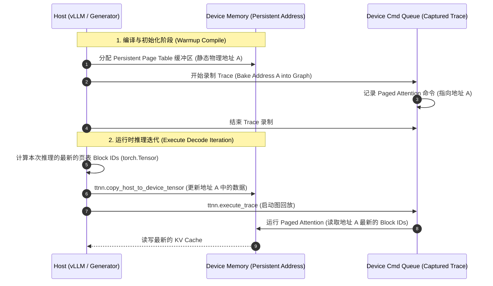

# TT-Metal 运行期 Trace 追踪 Paged Attention 技术解析

本篇技术文档详细解析了 Tenstorrent `tt-metal` 软件栈中，如何在启用**图追踪与回放（Trace Capture & Replay）**的同时，支持分页注意力机制（Paged Attention）。

---

## 1. 背景与技术挑战 (Background & Technical Challenges)

### 1.1 TT-Metal Trace 机制
在 Tenstorrent 芯片上运行模型时，传统的调度方式需要主机端（Host）逐个将算子/指令下发到设备端（Device）的命令队列（Command Queue）。对于大语言模型（LLM）的解码（Decode）阶段，存在大量耗时极短的微小算子（如 Eltwise ops），这会导致严重的**主机端分发瓶颈（Host Dispatch Bound）**。

TT-Metal 引入了 **Trace 机制**（`ttnn.begin_trace_capture`、`ttnn.end_trace_capture` 和 `ttnn.execute_trace`）：
* **Capture 阶段**：记录特定输入/输出张量地址上运行的一系列指令。
* **Replay 阶段**：只需发送单条指令（`ttnn.execute_trace`），设备端即可复现整条算子链。
* **核心限制**：Trace 会将**设备端物理缓冲区地址（Device Buffer Addresses）**静态硬编码在录制的指令图中。如果后续推理重新分配或改变了输入/输出的地址，Trace 将读写错误的内存空间，导致模型结果异常或程序崩溃。

### 1.2 分页注意力（Paged Attention）与 Trace 的冲突
分页注意力是现代 LLM 推理（如 vLLM 软件栈框架）的标配技术，通过按块（Block）分配物理 KV Cache 来解决显存碎片化。其特征为：
* **动态性极高**：在每次推理生成新 Token 时，调度器可能分配新的物理块，或者因为用户请求插入/淘汰而导致页表（Page Table，包含 Block IDs）被重新排列或追加。
* **多层独立页表**：对于混合注意力机制模型（如 Gemma 3，包含滑动窗口与全注意力交替），各层的页表和物理 Block 形状各不相同。

如果在 Trace 内部像普通算子一样动态创建或转换 Page Table 张量，每次调用 `ttnn.from_torch(page_table)` 都会分配新的设备缓冲区。这与 Trace 的“物理地址静态化”原则相违背。

---

## 2. 核心设计：持久化设备缓冲区与原位覆盖 (Core Design)

为了在 Trace Replay 时支持动态更新页表，`tt-metal` 采用了**“持久化设备缓冲区（Persistent Device Tensors） + 主机端原位覆盖（In-place Writes）”**的设计。其核心流程如下：



### 这一设计的精妙之处：
1. **静态地址，动态内容**：页表在设备上的物理内存地址在整个推理周期内**保持不变**，因此可以安全地烘焙（Bake）进 Trace 硬件指令图中。
2. **在原位进行内容改写**：每次迭代时，通过 `ttnn.copy_host_to_device_tensor` 直接覆盖该物理地址上的页表内容，操作迅速，且不会触发设备端的重新分配（No Allocation）。
3. **Trace 外执行更新**：数据复制（H2D Copy）操作在 Trace 指令流的外部执行，不属于被捕获的图指令。

---

## 3. 关键源码解析与位置说明 (Key Code Components)

以下为该机制在 `tt-metal` 仓库中的实现路径及代码逻辑解析：

### 3.1 vLLM 混合桥接中的页表分发
在 [generator_vllm.py](file:///home/stc/chengtao/tt-metal/models/tt_transformers/tt/generator_vllm.py) 中，`Gemma3ForConditionalGeneration` 与 `GptOssForCausalLM` 类实现了 `prefill_forward` 和 `decode_forward` 阶段页表的预更新：

以 `Gemma3ForConditionalGeneration.decode_forward` 为例：
```python
# models/tt_transformers/tt/generator_vllm.py
def decode_forward(self, *args, page_tables_per_layer=None, **kwargs):
    # 1. 确保每一层对应的页表对齐并填充
    page_tables_per_layer = self._ensure_page_tables_per_layer(page_tables_per_layer, kwargs.get("page_table"))
    per_submesh = self._chunk_page_tables_per_dp(page_tables_per_layer)

    if per_submesh is not None:
        for m, pt_for_submesh in zip(self.model, per_submesh):
            # 2. 在执行 Trace 之前，把页表内容更新到持久化缓冲区中
            m.update_persistent_per_layer_page_tables(pt_for_submesh)

    with self._route_per_layer_page_tables(per_submesh):
        # 3. 绕过占位符，直接路由到 Generator 真实的 decode 链路
        return super(HybridAttentionForCausalLM, self).decode_forward(*args, **kwargs)
```

### 3.2 延迟初始化与持久化页表管理器
在 [model.py](file:///home/stc/chengtao/tt-metal/models/tt_transformers/tt/model.py) 中，模型基类 `Transformer` 负责管理设备上的持久化页表缓冲区：

* **分配静态缓冲区 (`_page_tables_to_ttnn`)**：
```python
# models/tt_transformers/tt/model.py
def _page_tables_to_ttnn(self, page_tables_per_layer):
    if page_tables_per_layer is None:
        return None
    persistent = getattr(self, "_persistent_per_layer_page_tables", None)
    n = len(page_tables_per_layer)
    if persistent is None or len(persistent) != n:
        persistent = []
        for pt in page_tables_per_layer:
            if pt is None:
                persistent.append(None)
                continue
            if isinstance(pt, ttnn.Tensor):
                persistent.append(pt)
                continue
            # 首次调用时（Warmup Compile 编译阶段），在设备上分配页表物理空间
            persistent.append(
                ttnn.from_torch(
                    pt,
                    device=self.mesh_device,
                    dtype=ttnn.int32,
                    layout=ttnn.ROW_MAJOR_LAYOUT,
                    mesh_mapper=self._page_table_mesh_mapper(pt.shape[0]),
                )
            )
        # 将 persistent 页表句柄缓存到 self 上
        self._persistent_per_layer_page_tables = persistent
    return persistent
```

* **原位拷贝页表内容 (`update_persistent_per_layer_page_tables`)**：
```python
# models/tt_transformers/tt/model.py
def update_persistent_per_layer_page_tables(self, page_tables_per_layer):
    if page_tables_per_layer is None:
        return
    persistent = getattr(self, "_persistent_per_layer_page_tables", None)
    if persistent is None or len(persistent) != len(page_tables_per_layer):
        return
    for i, pt in enumerate(page_tables_per_layer):
        if pt is None or persistent[i] is None or isinstance(pt, ttnn.Tensor):
            continue
        # 将最新的主机端 Torch Tensor 转换为无设备的 ttnn 临时对象
        host_pt = ttnn.from_torch(
            pt,
            device=None,
            dtype=ttnn.int32,
            layout=ttnn.ROW_MAJOR_LAYOUT,
            mesh_mapper=self._page_table_mesh_mapper(pt.shape[0]),
        )
        # 在原位执行拷贝，将数据注入到先前分配的静态地址 persistent[i] 中
        ttnn.copy_host_to_device_tensor(host_pt, persistent[i])
```

### 3.3 单页表传统 Decode Trace 更新逻辑 (Legacy Single Page Table)
在单页表路径下（非 Hybrid Attention 结构），[generator.py](file:///home/stc/chengtao/tt-metal/models/tt_transformers/tt/generator.py) 的 `_decode_forward_trace_text` 也会自行检测页表变动并在 Trace 外侧覆盖输入缓冲区：

```python
# models/tt_transformers/tt/generator.py
# 监测页表是否发生改变（即追加了新页或打乱了输入）
if self.prev_page_table is None or any(
    not torch.equal(prev, curr) for prev, curr in zip(self.prev_page_table, page_table)
):
    reset_inputs = True
    if page_table is not None:
        self.prev_page_table = tuple(pt.clone() for pt in page_table)

if reset_inputs:
    for i in range(self.data_parallel):
        user_page_table = page_table[i] if page_table is not None else None
        # 重新在主机端打包 Token、当前位置、页表等数据
        host_inputs_i = self.model[i].prepare_decode_inputs_host(tokens[i], current_pos[i], user_page_table)
        # 通过原位覆盖，将最新的输入内容拷贝至 Trace 绑定的静态输入缓冲区
        copy_host_to_device(
            host_tensors=host_inputs_i,
            device_tensors=self.trace_inputs_decode[sampling_on_device][i],
        )

# 真正回放硬件指令（此时对应的输入缓冲区内容已经是最新的了）
for i, trace_id in self.trace_ids_decode[sampling_on_device].items():
    ttnn.execute_trace(self.model_args[i].mesh_device, trace_id, cq_id=0, blocking=False)
```

其中 `copy_host_to_device` 详见 [common.py](file:///home/stc/chengtao/tt-metal/models/tt_transformers/tt/common.py)：
```python
# models/tt_transformers/tt/common.py
def copy_host_to_device(host_tensors, device_tensors=None, mesh_device=None, shard_specs=None):
    if device_tensors is None:
        ...
    else:
        for i in range(len(host_tensors)):
            if host_tensors[i] is None:
                assert device_tensors[i] is None
                continue
            # 底层使用原位复制
            ttnn.copy_host_to_device_tensor(host_tensors[i], device_tensors[i])
        return device_tensors
```

### 3.4 注意力机制执行（Attention Blocks）
在 [attention.py](file:///home/stc/chengtao/tt-metal/models/tt_transformers/tt/attention.py) 中，`forward_decode` 阶段接收 `page_table` 张量，在执行中将其透传给具体的硬件级指令：

* **写入 KV Cache**：
  ```python
  # models/tt_transformers/tt/attention.py
  ttnn.experimental.paged_update_cache(
      keys, k_heads_1BKD, update_idxs_tensor=current_pos, page_table=page_table
  )
  ```
* **进行注意力点积计算**：
  ```python
  # models/tt_transformers/tt/attention.py
  attn_output_1G4D = ttnn.transformer.paged_scaled_dot_product_attention_decode(
      q_heads_1BQD,
      keys,
      values,
      page_table_tensor=page_table,
      cur_pos_tensor=current_pos,
      ...
  )
  ```
当这些算子在 Trace 阶段被录制时，硬件执行图上绑定的 `page_table` 张量对象，恰好就是我们在外部通过原位覆盖数据内容的那个持久化 `_persistent_per_layer_page_tables` 对象。

---

## 4. 总结与最佳实践 (Summary & Best Practices)

要使分页注意力在 TT-Metal Trace 图中正常跑通且保证极高的吞吐率，其设计方案可以总结为：

1. **静态分配**：必须在进行 `begin_trace_capture` 捕获动作之前，将页表作为静态输入设备张量（Persistent Device Tensor）提前分配完毕。
2. **命令绑定**：在捕获期间，将该持久化张量引用传入点积注意力算子。
3. **按步复写**：每次启动 Trace 图回放前，在 Python 侧评估最新的物理页 ID，并使用 `copy_host_to_device` 越过 Trace 本身进行原位（In-place）改写。
4. **无需重新录制**：得益于物理地址的固定，即使页表对应的物理块在动态频繁地更新，也无需针对新块重新捕获（Re-capture）Trace，大幅节省了编译与重录制的运行期开销。
